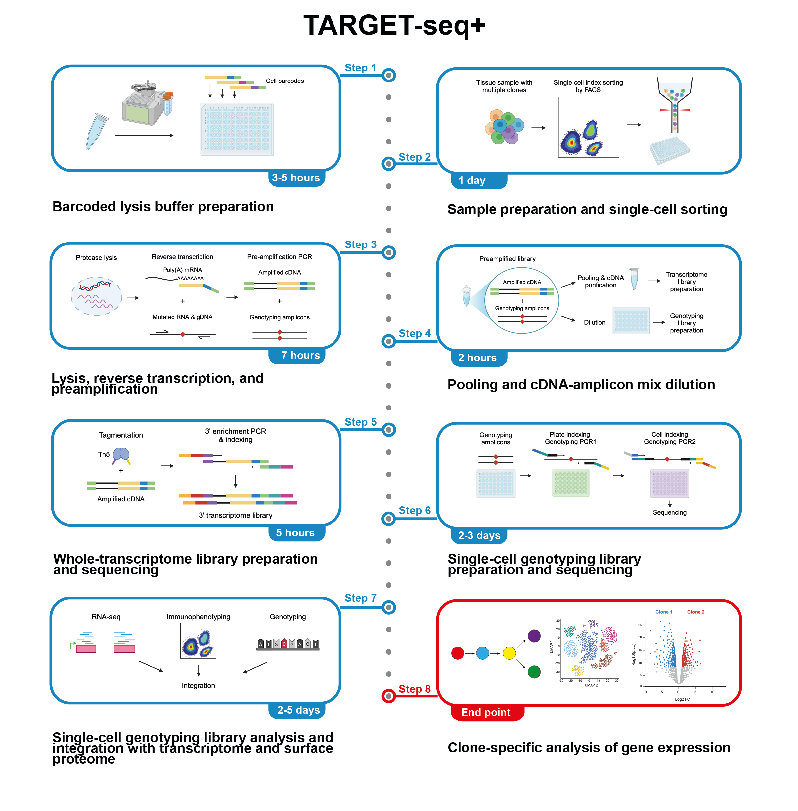

# TARGET-seq+

TARGET-seq+ is a modified version of TARGET-seq, a multi-omic method for simultaneous capture of single-cell genotype, RNA-seq, and surface protein expression. By incorporating elements of the Smart-seq3 chemistry, TARGET-seq+ increases the number of cells passing quality filters and the number of genes detected per cell, thus improving the detection of lowly expressed genes, whilst retaining high-fidelity single-cell genotyping. 

This repository contains a collection of scripts for the analysis of TARGET-seq+ data.

For details of the method see our manuscript:

[Jakobsen, Turkalj, Zeng et al,. Selective advantage of mutant stem cells in human clonal hematopoiesis is associated with attenuated response to inflammation and aging, Cell Stem Cell 2024](https://doi.org/10.1016/j.stem.2024.05.010)

## Analysis overview

Broadly, the analysis workflow contains the following steps:
1.	Analysis of FACS indexing data
2.	Analysis of single-cell genotyping data within each patient sample and integration with flow cytometry indexing data to generate metadata for the full dataset
3.	Pre-processing of transcriptome data
4.	Integration of the full dataset and downstream analysis

We provide an example dataset for testing the analysis workflow in the `data` directory.

## 1. Analysis of FACS indexing data

Run the [FACS_indexing_analysis.R](https://github.com/asgerjakobsen/TARGET-seq-plus/blob/main/code/1_facs_indexing/FACS_indexing_analysis.R) script.

This step gathers cell surface immunophenotyping data from FACS index sorting files into a single table. 
From these data, we know which immunophenotypic cell type was sorted into each well and the sample donor ID. This is important for defining which cells belong to the control and test samples when performing downstream analysis.

Using the cell surface immunofluorescence values, we can gate for positive and negative cells to define immunophenotypic populations.

The output of this step is a table of cell IDs and FACS indexing values for the full dataset.

## 2. Analysis of single-cell genotyping

These steps take targeted amplicon sequencing FASTQ files and assign a genotype to each cell at each locus of interest.

1. Generate a demultiplexing file for use in the TARGET-seq SCpipeline and a metadata file for genotyping analysis:
    - [01_Make_genotyping_demultiplexing_file.R](https://github.com/asgerjakobsen/TARGET-seq-plus/blob/main/code/2_genotyping/01_make_genotyping_demultiplexing_file.R)

2. Run the TARGET-seq SCpipeline (https://github.com/albarmeira/TARGET-seq) to pre-process the targeted single-cell genotyping data:
    - Demultiplex the data into separate FASTQ files for each cell by running the `GenoDemux_Fastq.sh` script.
    - Run the `SCgenotype.pl` pipeline script to align reads to the genome, separate cDNA/gDNA amplicons and perform mpileup variant calling. The script generates summary tables of allelic counts for each mutation locus per cell which are found in the `Summarize` directory.

3. For indels, run the separate [indel preprocessing pipeline](https://github.com/asgerjakobsen/TARGET-seq-plus/blob/main/code/indel_preprocessing) since these are often not called correctly by mpileup variant calling:
    - Create fasta files with the genotyping PCR1 primer sequences. Examples are provided.
    - Run the [indel_mutation_grep.sh](https://github.com/asgerjakobsen/TARGET-seq-plus/blob/main/code/indel_preprocessing/indel_mutation_grep.sh) script. This takes demultiplexed FASTQ files as input and uses `cutadapt` to separate cDNA/gDNA amplicons based on the PCR1 primer sequences. It then uses `fastq-grep` to count the reads with the WT and mutant sequence in each cell. Use a minimal unique sequence for the grep function, e.g. 5 bp either side of the mutation. Depending on the site of the mutation, either the forwards (R1) or the reverse (R2) sequencing reads should be used for allele counting.
    - The resulting allele count files can be used in genotyping calling analysis in the same way as those from the TARGET-seq pipeline.

4. Perform genotyping calling for each mutant locus (the second scripts also utilizes a germline SNP to control for allelic drop-out): 
    - [02_Genotype_calling_NOC131_DNMT3A_I780T.R](https://github.com/asgerjakobsen/TARGET-seq-plus/blob/main/code/2_genotyping/02_Genotype_calling_NOC131_DNMT3A_I780T.R)
    - [03_Genotype_calling_NOC131_DNMT3A_Q606X.R](https://github.com/asgerjakobsen/TARGET-seq-plus/blob/main/code/2_genotyping/03_Genotype_calling_NOC131_DNMT3A_Q606X.R)

5. Integrate the genotypes within single cells to assign clonal identities within each sample:
    - [04_Clone_assignment_NOC131.R](https://github.com/asgerjakobsen/TARGET-seq-plus/blob/main/code/2_genotyping/04_clone_assignment_NOC131.R)

6. Integrate the FACS indexing and single-cell genotyping data to make a metadata file for multi-omic analysis:
    - [05_Integrate_metadata.R](https://github.com/asgerjakobsen/TARGET-seq-plus/blob/main/code/2_genotyping/05_Integrate_metadata.R)

## 3. Pre-processing of transcriptome data

To pre-process TARGET-seq+ transcriptome data, we have written a custom python pipeline: [TARGET-seq-plus-RNA](https://github.com/asgerjakobsen/TARGET-seq-plus-RNA). 

This takes FASTQ files and performs single-cell demultiplexing, mapping, and gene feature counting. The gene counts from STARsolo are used in downstream analysis.

## 4. Integration of transcriptome data with genotyping and FACS indexing

Integration of transcriptome data with genotyping and FACS indexing data relies on shared cell identifiers. 

The transcriptome cell barcodes in the outputs from the pre-processing pipeline are derived from the combination of libraries with unique i5/i7 plate indexes and oligo-dT cell barcodes.

Run the [Reformat_counts_matrix.R](https://github.com/asgerjakobsen/TARGET-seq-plus/blob/main/code/3_rna/Reformat_counts_matrix.R) script to join the transcriptome cell barcodes to the descriptive cell IDs from FACS that match those in the other metadata. This then takes the outputs from STARsolo and reformats the transcriptome counts matrix with gene name and cell IDs. 

The resulting counts matrix can be used with the integrated metadata file in single-cell genomics analysis packages for downstream analysis.

## Contact

All scripts were written by [Asger Jakobsen](https://www.imm.ox.ac.uk/people/asger-jakobsen). 

In case of problems or doubts about the scripts please raise an issue.

